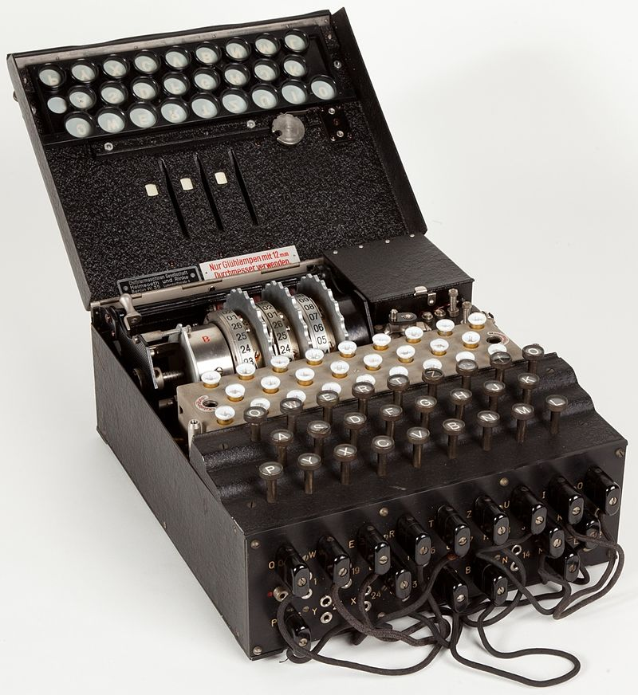

# 🔐 Enigma Machine Simulator



This project is a simulation of the **Enigma machine**, a cipher device used by Germany during World War II. It demonstrates how encryption and decryption work using rotors, a reflector, and soon a plugboard, all written in Python and designed to be understandable, modifiable, and expandable.

---

## 📜 What is the Enigma Machine?

The **Enigma machine** was an electro-mechanical rotor cipher machine used primarily by Nazi Germany during World War II to encrypt military communications. Invented by German engineer **Arthur Scherbius** in the early 1920s, the machine gained historical significance due to its complex encryption system, which made it incredibly difficult to crack without knowing the machine settings.

The Enigma's security was based on a combination of components:
- A **keyboard** to input plain text
- **Rotors** that substituted letters based on electrical wiring and rotated after each keystroke
- A **reflector** that sent the current back through the rotors
- A **plugboard** that swapped letters before and after rotor transformation

Despite its sophistication, the Enigma cipher was famously **cracked by Alan Turing and his team at Bletchley Park**, significantly aiding the Allied war effort.

---

## 🧠 How We Translated Enigma Into Python

The core principle of the Enigma was **polyalphabetic substitution**, achieved by a series of rotating wheels (rotors) and a symmetric wiring system.

### ✅ Key Python Features Implemented:
- **Three rotors (rotorI, rotorII, rotorIII)**: These act as substitution ciphers that shift with each letter.
- **A reflector**: Mirrors the signal back through the rotors in reverse.
- **Rotor stepping logic**: After every keypress, rotorI rotates; rotorII rotates every 26 steps, and rotorIII every 26×26 steps.
- **Symmetric encryption**: The same function is used for both encoding and decoding as long as initial rotor positions are reset.

### 🔁 How the Code Works:
1. Each letter goes through **rotorI → rotorII → rotorIII**.
2. Then it hits the **reflector**, which reverses it.
3. The signal travels back through **rotorIII → rotorII → rotorI** (using inverse logic).
4. After each letter, rotors **rotate**, changing the substitution.

Here’s a simplified view of the process:

```text
Plaintext → Rotor I → Rotor II → Rotor III → Reflector → Rotor III → Rotor II → Rotor I → Ciphertext
```

## 🔌 What is the Plugboard?

The **plugboard** (or **Steckerbrett** in German) was a critical part of the real Enigma machine. It allowed the user to manually **swap letters** before and after the rotor encryption process. For example, plugging A into G meant every A would become G (and vice versa) before entering the rotors.

### 📌 Planned Implementation:

```python
def apply_plugboard(letter, plugboard_settings):
    return plugboard_settings.get(letter, letter)
```

## 🚧 Future Plans and Features

We have several improvements planned to make the Enigma simulator even more realistic and user-friendly:

### 1. ✅ Plugboard Support
- Customizable plugboard configuration by the user.
- Dynamic letter swapping logic before and after the rotor path.

### 2. 🌐 Web-Based Interface
- Develop a web frontend using Flask or Django.
- Simulate the Enigma machine in the browser with graphical rotors, keyboard input, and real-time encryption.

### 3. ⚙️ Custom Rotor Configuration
- Allow users to manually set initial rotor positions.
- Let users select the rotor order (e.g., I, II, III or III, I, II).
- Option to save/load presets.

### 4. 💾 Configuration Files
- Enable exporting/importing rotor and plugboard settings via JSON or `.ini` files.
- Save encryption sessions for reproducibility.

### 5. 🧪 Unit Tests and Debugging
- Implement tests to ensure encryption/decryption accuracy.
- Add logging or verbose mode to debug the encryption path of a character.

### 6. 🔐 Enhanced Encryption Tools
- Add support for more rotors (IV, V, etc.).
- Optional rotor ring settings (`Ringstellung`) to match historical Enigma configurations.

---
## 📖 Learn More About Enigma

[Wikipedia](https://en.wikipedia.org/wiki/Enigma_machine)


Stay tuned for updates, and feel free to contribute ideas!


